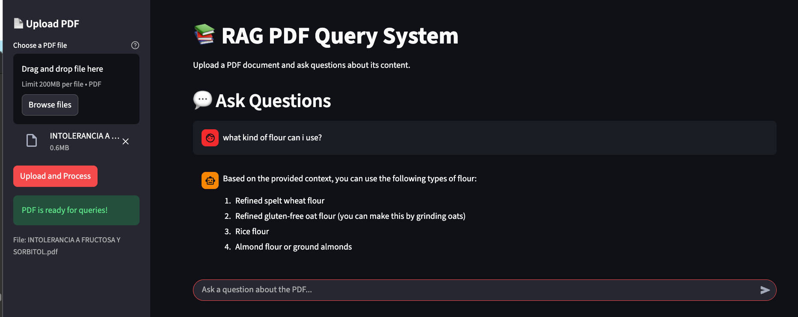

# 📄 DocQuery - RAG Based Document Assistant

**DocQuery** is an AI-powered document Q&A system that allows users to upload PDF documents and ask questions about their content using **Retrieval-Augmented Generation (RAG)**.

## Features

* PDF text extraction and chunking
* Semantic search using Sentence Transformers + FAISS
* RAG-based question answering
* LangChain integration
* Local LLM inference with Ollama + Qwen2.5 3B
* FastAPI REST API
* Streamlit web interface

## Architecture

```text
PDF Upload
    ↓
Text Extraction & Chunking
    ↓
Sentence Transformer Embeddings
    ↓
FAISS Vector Search
    ↓
Relevant Document Chunks
    ↓
LangChain + Qwen2.5 3B
    ↓
Context-Aware Answer
```

## 🛠️ Tech Stack

| Component       | Technology            |
| --------------- | --------------------- |
| Language        | Python                |
| RAG Framework   | LangChain             |
| LLM             | Qwen2.5 3B via Ollama |
| Embeddings      | all-MiniLM-L6-v2      |
| Vector Store    | FAISS                 |
| PDF Processing  | PyPDF                 |
| Backend         | FastAPI               |
| Frontend        | Streamlit             |
| Package Manager | uv                    |

## Run Locally

### 1. Install dependencies

```bash
uv sync
```

### 2. Install and run Ollama

Install [Ollama](https://ollama.com/) and download the model:

```bash
ollama pull qwen2.5:3b
```

### 3. Start the FastAPI backend

```bash
uv run uvicorn backend.main:app --host 127.0.0.1 --port 8000
```

API documentation:

```text
http://127.0.0.1:8000/docs
```

### 4. Start the Streamlit frontend

In a second terminal:

```bash
uv run streamlit run frontend/app.py
```

Open:

```text
http://localhost:8501
```

Upload a PDF and start asking questions.

## RAG Pipeline

1. **Document Processing** — Extract text from the uploaded PDF.
2. **Chunking** — Split the document into smaller text segments.
3. **Embedding** — Convert chunks into semantic vectors using `all-MiniLM-L6-v2`.
4. **Retrieval** — FAISS finds the most relevant chunks for the user's query.
5. **Generation** — LangChain passes the retrieved context to Qwen2.5 3B through Ollama.
6. **Response** — The generated answer is returned through the FastAPI API and displayed in Streamlit.
